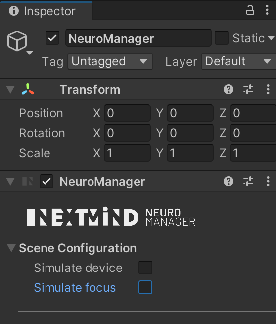

# NextMind Setup

This document covers how to setup the NextMind Unity app and server on the stretch to enable mind-controlled operation of the stretch robot.

## Stretch server

Move the 'nextmind-stretch-server' folder to the stretch robot directory, and ensure you have the control agent fiels also loaded onto the stretch. Ensure the path commands variable in [app.py](./nextmind-stretch-server/app.py) reflect the install location of the python 2.7 motion scripts if using a different location than "/home/hello-robot/Chatbot"

`N.B. These scripts will be replaced as soon as a python 3 module is available for robot move functionality`

To start the server on the stretch, ensure the correct libraries are installed according to `requirements.txt`.

In a terminal on the app, make sure no other processes are running, and then run

```
$ uvicorn app:app
```

A local server will now be running on the stretch robot

## ngrok

In order to expose the local server for use on other devices, as required for NextMind connection, run:

`ngrok https 8000`

to expose localhost:8000 - change the port number if the uvicorn server is not running on the default port.

You should now be able to access the uvicorn server by using the web address returned by the ngrok command. Make note of the address:

```Tunnel Status                 online
Version                       2.0/2.0
Web Interface                 http://127.0.0.1:4040
Forwarding                    http://92832de0.ngrok.io -> localhost:8000
Forwarding                    https://92832de0.ngrok.io -> localhost:8000
```

Where the URL of form [id].ngrok.io replaces 'localhost'. Make note of this url

## Unity

Currently, the url needs to be given to unity manually. Update line 119 of [MoveFunctions.cs](./nextmind-robot-telepresence/Assets/Scripts/MoveFunctions.cs) with the ngrok url:

```
using (UnityWebRequest www = UnityWebRequest.Post($"[server.path.here]/{method}/{ammount}", form))
```

Next, run the unity app by opening the [nextmind-robot-telepresense](./nextmind-robot-telepresence) directory in the unity explorer.

Click run in the unity editor

### NextMind Calibration

The default settings allow for a NextMind device to be simulated with mouse clicks. You can simply click on the area of the screen of interest to move the stretch robot. The longer you maintain focus on a control before release, the more the robot will move in that direction.

In the current version to use a real device, you will need to first connect and calibrate the device using the default calibration screens. This can be achieved either using the NextMind Unity samples, or more simply by opening the default [first steps demo app](https://www.next-mind.com/developer/). Run the app, and follow instructions to connect the NextMind to your device. Complete the standard calibration steps as instructed.

Once calibrated, the first steps app can be closed, and the unity telepresence app can be run. Make note of your NextMinds unique ID.

`Note: Do not power off the NextMind, or make any alterations that may affect calibration of the device`

The device should now connect to the app on start up. This can be confirmed in the top right-hand corner of the app where the NextMind device ID can be seen along with connection status and battery level.

The NextMind can now be used to directly instruct the robot according to the available control interface, as long as the NextMind stays connected and has been correctly calibrated.

### Troubleshooting

If you are having problems connecting the NextMind to the app once calibration has been complete, open the inspector tab for the 'Neuro Manager' asset, and un-tick 'Simulate device' and 'Simulate focus' as shown below.


