# Documentation Overview
As in the main readme, this repository is intended to test out integrations with our current research topics, from human-robot integration, intelligent edge computing, through to 5G and fleet control of robotics.

Because of that, you could install and setup every widget and configuration, but you are unlikely to need every single widget installed at once.

## Related Docs
- [Folder Structure and package requirements](structure.md)
- [How to set up the Rocos Platform](rocos-setup.md)
- [How to test locally](local-testing.md)

# Overall Flow
- Unity Application - *The Unity application embeds the NextMind SDK. It receives a video stream from the robot, and sends movement commands to the robot.*
- Cloud App - *The Unity app connects to the Cloud App. The Cloud App forwards messages to the relevant robot maanagement platform - Rocos, for organizations that may have many robots; or IoT hub for organizations testing and controlling single robots.*
- Robot Management
  - Rocos - *Messages are forwarded to the Rocos platform, and video is sent to the NextMind Unity app.*
  - IoT Hub - *Messages are forwarded to the Python Agent, which should be running on the Stretch. Video is sent to the NextMind Unity app, using an [IoT Hub Device Stream[(https://docs.microsoft.com/en-us/azure/iot-hub/iot-hub-device-streams-overview).*
- Agent
  - Ros Agent - *The Ros agent is provided by the Rocos platform.*
  - Python Agent - *The Python agent is found in this repository.*

# Technical Architecture
## Choice of Architecture
For controlling one simple robot, the IoT hub route provides fine grained control, particularly in a homogenous system.

The Rocos platform is designed to control heterogenous robots and is suited for organizations with multiple robot types.

All control versions connect the unity app to a deployed cloud application, and the cloud application can be configured to communicate with either an IoT Hub or Rocos.
## Cloud App Python Agent Option
- Unity Application with Nextmind in C# calls Cloud App
- Cloud App forwards API calls via IoT Hub
- A streaming video feed is retrieved using an IoT Hub Device stream by the Cloud App, and passed to the Unity App
- Rocos interacts with Stretch
- Video streaming in response is displayed in the Unity Application

## Cloud App to Rocos Option

- Unity Application with Nextmind in C# calls Cloud App
- Cloud App forwards API calls to Rocos
- A streaming video feed is retrieved from Rocos by the Cloud App, and passed to the Unity App
- Rocos interacts with Stretch
- Video streaming in response is displayed in the Unity Application

# Adding to the documentation
## Requirements
### Diagrams
Run the following commands to install `graphviz`, and set up an environment to be able to generate documentation images.

`brew install graphviz`
`conda create --name stretchlabs python=3.9 -y`
`pip install diagrams`

### Mermaid
Install the [Mermaid Extension for VS Code](https://marketplace.visualstudio.com/items?itemName=tomoyukim.vscode-mermaid-editor).

Generate images as .mmd files are updated, and commit them.

## Image Generation
Diagrams are generated with [Python Diagrams](https://pypi.org/project/diagrams/) and using the [Mermaid Extension for VS Code](https://marketplace.visualstudio.com/items?itemName=tomoyukim.vscode-mermaid-editor), which supports most [mermaid formatting](https://github.com/mermaid-js/mermaid/blob/master/README.md), in the .mmd format.